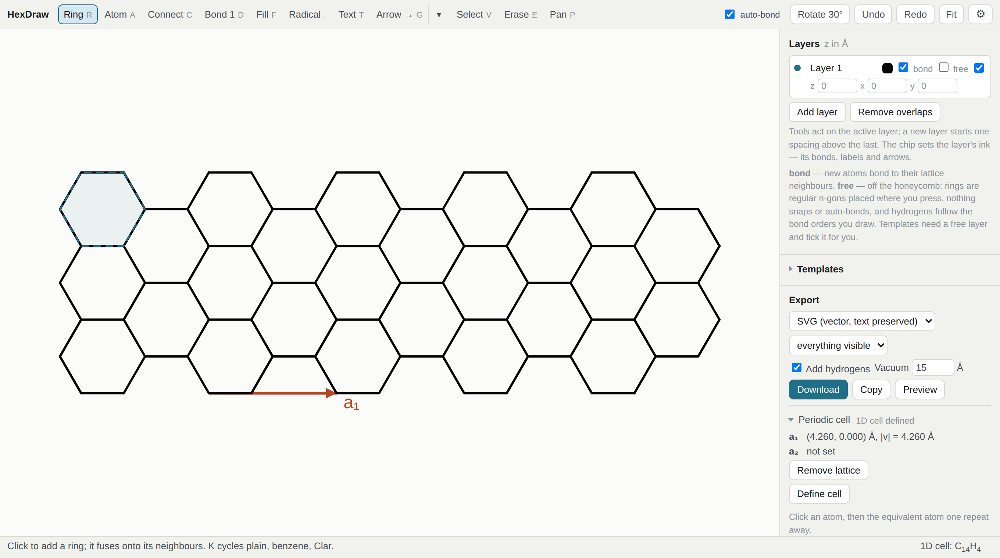

# HexDraw

A single-file editor for drawing sp² carbon nanostructures — polycyclic aromatic hydrocarbons, graphene nanoribbons, triangulenes, phthalocyanines and porphyrins — and exporting them as publication-ready figures or as atomistic input for DFT.

Bonds are 1.42 Å throughout, so the drawing *is* the geometry: what you export to XYZ is exactly what you see, with hydrogens added for you.



**[Open HexDraw in your browser](https://amoghkinikar.github.io/hexdraw/hexdraw.html)** — nothing to install. Or download [`hexdraw.html`](hexdraw.html) and double-click it; it works offline and makes no network requests.

## What it does

- **Honeycomb layers** snap everything to the graphene lattice: click to add a ring, it fuses onto its neighbours, and the chemical formula updates in the status bar as you draw.
- **Free layers** for everything that is not hexagonal: 3- to 8-membered rings placed where you draw them, bonds aimed in 15° steps, explicit valence, with phthalocyanine and porphine as built-in templates.
- **Periodic structures**: pick two equivalent atoms to define a₁ (and a₂); exports then contain one unit cell, and the app tells you if the cell is not a true repeat of the drawing.
- **Export** to SVG (labels stay editable text), EMF for PowerPoint and Word, PNG, extended XYZ, POSCAR and MOL V2000. `Ctrl+C` copies the drawing as an image.
- **Figures**: benzene rings and Clar circles, wedge, hash and dashed bonds, radicals and lone pairs, charges, ring fills, per-object colour, reaction and equilibrium arrows, curly electron-pushing arrows, brackets and plus signs.
- **Layers** with independent z and in-plane offsets, for bilayers and stacked molecules.
- **Project files** (`.json`) to come back to a drawing later; a **style sheet** and journal presets (Nature, ACS) for consistent figures.

## Getting started

1. Open the page, or `hexdraw.html`, in Chrome, Firefox, Edge or Safari.
2. Click on the canvas. That is a benzene ring; every further click fuses another one on.
3. Press `K` for benzene bonds or Clar circles, `T` to name an atom, `G` to draw an arrow, `V` to select. The status bar always says what the current tool does; the ⚙ dialog has a **Keys** tab with the full list.
4. **Export** in the side panel: SVG for a figure, XYZ with *Add hydrogens* for a starting geometry.

The [examples](examples/) folder has six project files — [3]triangulene, a 7-AGNR with its unit cell, AB-stacked bilayer coronene, nitrogen-doped graphene with a 2×2 cell, iron phthalocyanine on a free layer, and a reaction scheme. Open one with **Open project** to see how each is put together; the [manual](docs/manual.md#examples) walks through drawing them.

## Documentation

The **[manual](docs/manual.md)** covers every tool, panel and key, the two kinds of layer, periodic cells, how hydrogens are counted, every export format and the project-file schema. A few sections you will want early:

- [Tools](docs/manual.md#tools) — what each button does, with its shortcut
- [Free layers](docs/manual.md#free-layers-non-hexagonal-molecules) — non-hexagonal molecules
- [Periodic structures](docs/manual.md#periodic-structures) — defining a unit cell for XYZ and POSCAR
- [Export](docs/manual.md#export) — into Illustrator, PowerPoint, ASE, Quantum ESPRESSO and CP2K
- [How hydrogens are counted](docs/manual.md#how-hydrogens-are-counted)
- [Limitations](docs/manual.md#limitations) — read this before you trust a geometry

## Development

One HTML file, vanilla JavaScript, no build step, no dependencies at runtime. The tests need Node and, for the browser suite, Playwright:

```bash
npm install            # Playwright, for the browser suite only
npm test               # thirteen suites; exits non-zero if any fails
```

Most suites run the app's own functions under a stub DOM; `tests/t_browser.js` drives a real page in Chromium and skips itself if Playwright is absent. `npm run examples` regenerates the example project files and the screenshot from the app itself.

Contributions are welcome. When reporting a drawing or export bug, attach a project file — it is the fastest way to reproduce it.

## Citing

If HexDraw was useful in your work, `CITATION.cff` has the reference; GitHub renders it under *Cite this repository*.

## License

MIT. See [`LICENSE`](LICENSE).
